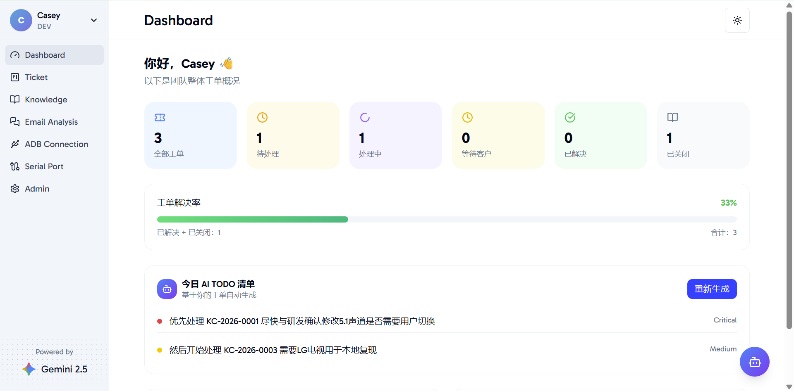
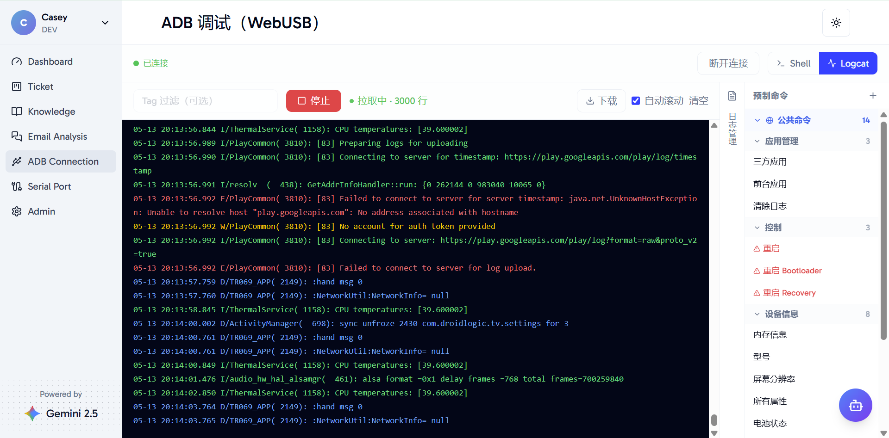

# Friendly AI Explorer (FAE System)

<p align="center"><a title="简体中文" href="./README.md">🇨🇳 简体中文</a>  |  🇬🇧 English</p>

## 1. Overview

**Friendly AI Explorer** is an AI-powered work and collaboration platform designed for FAE technical support teams, aiming to improve technical support efficiency through the use of AI.

### Core Features

| Module | Description |
| --- | --- |
| 📊 Dashboard | Provides a visual overview of tickets, tasks, and team activities |
| 🎫 Ticket Management | Supports the creation, tracking, and management of customer issues and defect tickets |
| 📚 Knowledge Base | Supports the management, organization, and retrieval of technical documentation |
| 📩 Email Assistant | Supports AI-assisted management of work email |
| 🛠️ OTT Debug | Integrates selected debugging capabilities from the original FAE Toolkit, including WebUSB and Serial |
| 🤖 AI Engine | Supports online AI models such as Gemini as well as local models deployed with vLLM, with support for RAG (Retrieval-Augmented Generation) |

---

## 2. Technology Stack

### Frontend

- React
- Tailwind CSS
- shadcn/ui

### Backend

- Python 3.11
- FastAPI
- Uvicorn
- SQLAlchemy 2.0
- Celery
- Redis

### Database

- PostgreSQL 16
- pgvector

---

## 3. Screenshots

### Dashboard



### ADB Debug



---

## 4. Quick Start

Clone the repository:

```bash
git clone https://github.com/kcjiang/friendly-ai-explorer.git
cd friendly-ai-explorer
```

Build and start the project with Docker Compose:

```bash
docker compose -f docker-compose.yml up -d --build
```

After the services are started, open the following address in your browser:

```text
http://localhost:3000
```

---

## 5. Contributing

We welcome all contributions! Please read our [contributing guide](./CONTRIBUTING.md) to learn about our development process and how to propose bugfixes and improvements.

---

## 6. Acknowledgements

The frontend of this project is developed based on the following open-source project:

[visactor-next-template](https://github.com/mengxi-ream/visactor-next-template) · [Live Demo](https://visactor-next-template.vercel.app/)

Thanks to the original project authors and all contributors to the open-source community.